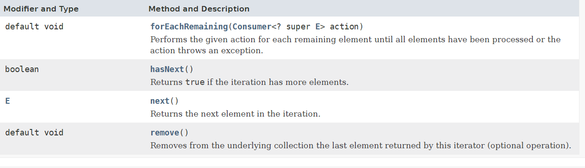

# Cursors
 useful for retriving object one by one from collection.

 1.Enumeration -->legacy class (stack,vector)
 2.Iterator
 3.ListIterator
 4.Spliterator

 Interface Iterator<E>

An iterator over a collection. Iterator takes the place of Enumeration in the Java Collections Framework.

Iterators differ from enumerations in two ways:
* Iterators allow the caller to remove elements from the underlying collection during the iteration with well-defined semantics.
* Method names have been improved.

forEach
1.Only forward direction
2.No removal

Iterator
1.Forward
2.Removing is possible

ListIterator:
1.Bidirectional cursor
2.Read/ remove/Replace

//li.previous();
//li.hasPrevious();
//li.set(names);
li.add("arun");//add first
